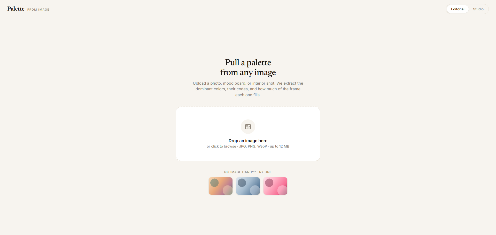
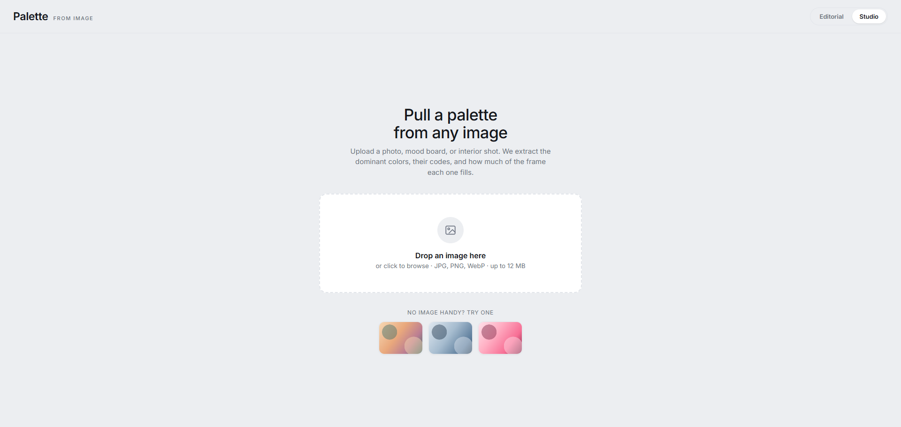
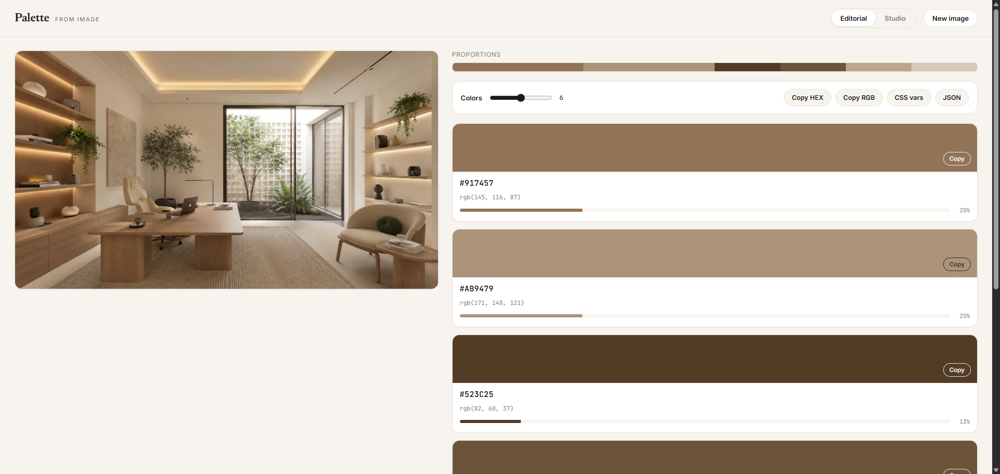
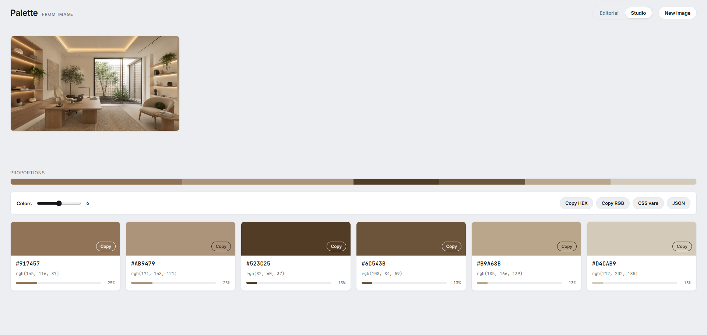

# Palette From Image

A web app that extracts a color palette from any image. Upload (or drag and drop) a photo, and the app pulls out the dominant colors with their HEX / RGB codes and the share of the frame each color fills. Copy or export the result in one click. All processing runs locally in the browser using Canvas — images are never uploaded to a server.

> **Status: Prototype.** This is a high-fidelity, functional prototype intended for design review and developer handoff — not a production release. Color extraction is fully working; surrounding concerns (routing, persistence, analytics, accessibility audit, browser-support matrix) are out of scope for this stage.

---

## Screenshots

The app ships in two design directions, switchable live from the top-right toggle: **Editorial** (warm tone, serif headings, image beside the palette) and **Studio** (cool tone, sans headings, image above a swatch grid).

| Editorial | Studio |
| --- | --- |
|  |  |
|  |  |

---

## Deliverables

Three Design Component files plus one runtime. They all live in the same folder.

| File | Purpose | Required to run |
| --- | --- | --- |
| `Palette From Image.dc.html` | The real, working app — live extraction, copy/export, two design directions | Yes |
| `Palette Flow.dc.html` | Presentation file: an Overview of every state side by side, plus a clickable walkthrough | Optional |
| `Palette Screen.dc.html` | Child component used by `Palette Flow` to render each state mockup | Required only by `Palette Flow` |
| `support.js` | Runtime that lets the `.dc.html` files open in a browser. Must sit in the same folder. | Yes |

For developer handoff of the product itself, ship `Palette From Image.dc.html` and `support.js`. Include the two flow files if the team also wants the state overview and click-through.

---

## How to run

1. Keep the `.dc.html` files and `support.js` together in one folder.
2. Open any `.dc.html` directly in a browser. For reliable font and asset loading, serve the folder with a static server (for example `npx serve`).

Embed a component inside another page or component with:

```html
<dc-import name="Palette From Image"></dc-import>
```

---

## 1. The app — `Palette From Image.dc.html`

A single continuous flow: open, upload, see the palette, copy or export. The screens described in the brief are handled as states within this one view, so the user never loses the context of the image they just uploaded.

### States

| State | Behavior |
| --- | --- |
| Empty / Home | Drop zone for drag-and-drop or click-to-browse, plus built-in sample images |
| Loading | Spinner while colors are read |
| Result + Export | Uploaded image, a proportion bar, and one card per color (HEX, RGB, share) — with the export controls in the same view |
| Error | Inline notice when the file is not an image or exceeds 12 MB |

### Core features

- Upload by drag-and-drop, file browse, or one of the built-in sample images
- Extract 4–8 dominant colors, adjustable with a slider (re-extracts instantly)
- HEX and RGB codes for every color, plus its share of the frame
- Copy / export in four formats: HEX list, RGB list, CSS variables, JSON
- Two design directions, switchable live (see Configuration)
- Responsive for desktop (1440px) and mobile (390px)

### Edge cases handled

- Non-image files — prompts the user to use JPG, PNG, or WebP
- Files over 12 MB — prompts the user to choose a smaller file
- Unreadable images — prompts the user to try another file

### Configuration (props / tweaks)

| Prop | Type | Default | Meaning |
| --- | --- | --- | --- |
| `direction` | `'A'` or `'B'` | `'A'` | Design direction. A = Editorial (warm tone, serif headings, image beside palette). B = Studio (cool tone, sans headings, image above a grid of swatches). Also switchable live from the top-right toggle. |
| `defaultColors` | `int` 4–8 | `6` | Starting number of colors in the palette |

---

## 2. The presentation file — `Palette Flow.dc.html`

A separate artifact for review and handoff. It does not affect the app. Two modes, switched from the top toggle:

- **Overview** — every state laid out as labeled frames side by side (Empty, Loading, Result + Export, Error, and a Mobile 390px frame). Scroll horizontally to scan the whole flow at once.
- **Click-through** — one live screen inside a browser frame. Click the drop zone or a sample to advance Empty → Loading → Result; use "New image" to reset; "Simulate an upload error" to reach the Error state.

Both modes are driven by the shared child component `Palette Screen.dc.html`, so the mockups stay consistent with one source of truth.

---

## 3. How extraction works (for developers)

The app uses median-cut quantization:

1. Downscale the image so its longest edge is at most 160px, draw it to a Canvas, and read every pixel.
2. Start with one box containing all pixels. Repeatedly split the box with the widest color range (weighted by pixel count) in half along its most-spread channel, until the number of boxes equals the requested color count.
3. Average the pixels in each box to get its representative color, and compute each color's share from the pixel count in its box.
4. Sort colors from largest share to smallest.

Each color's luminance decides the label color on its card (black or white) for readability.
